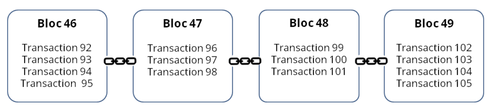
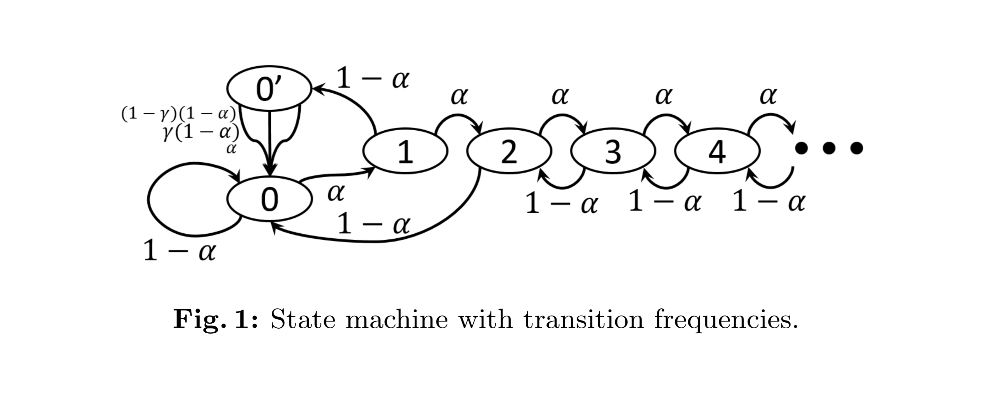
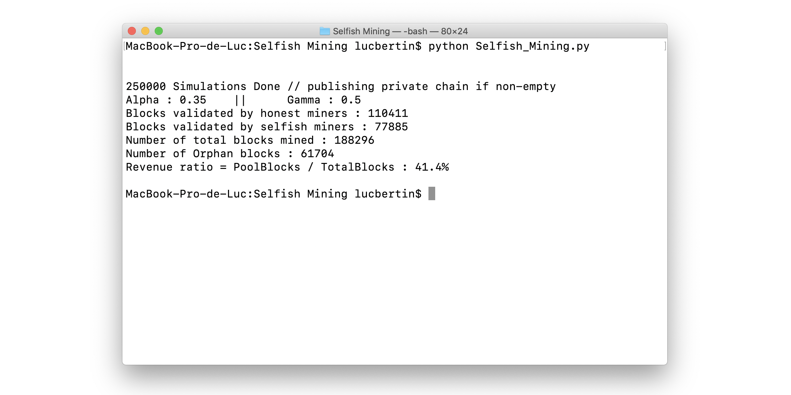
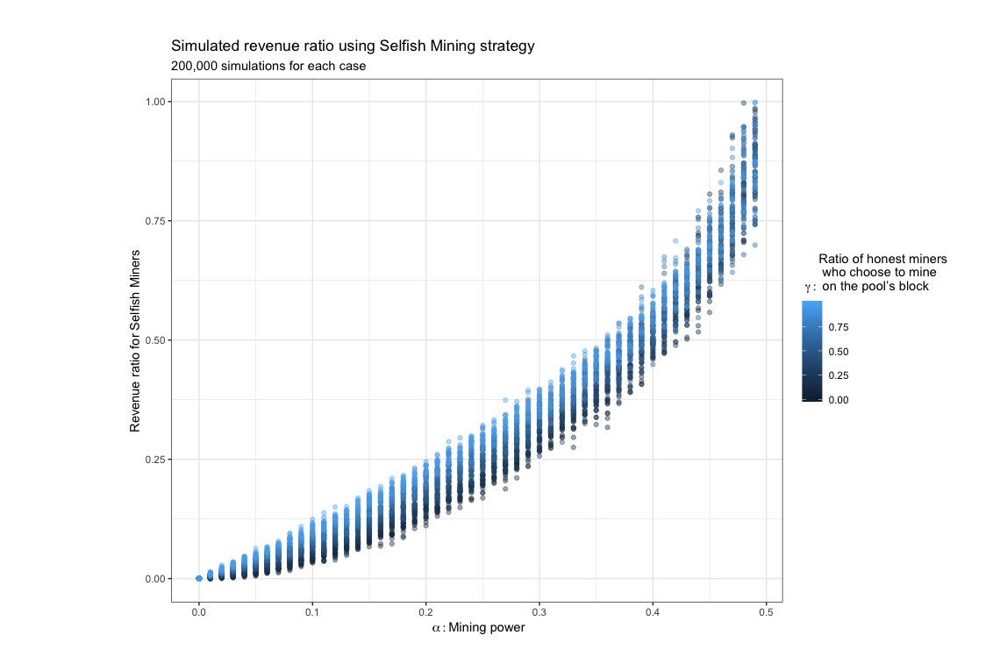

# Algorithm : Selfish Mining 
### Based on the paper: *Majority is not Enough* [link](https://www.cs.cornell.edu/~ie53/publications/btcProcFC.pdf)
### and [*On profitability of Selfish Mining*](https://webusers.imj-prg.fr/~ricardo.perez-marco/publications/articles/OnSelfishMining20.pdf)

## Brief Introduction :

The *blockchain* is the protocol on which *bitcoin* is based. These 2 terms have received a lot of public attention over the past few months, despite they have been both created purposefully a few years ago.

Bitcoin blockchain is, to put it plainly, a huge log in which each bitcoin transactions in the world are encrypted. It is subdivided in block, and each block can contain multiple transactions.

Here is a overview of the above definition taken from [Blockchain France](https://blockchainfrance.net/decouvrir-la-blockchain/c-est-quoi-la-blockchain/)

Thus, to ensure transactions, blocks need to be created or - in other terms - 'mined'. That's achieved resolving a cryptopuzzle with increasing complexity, requiring computer ressources. One could mine on its own, but with increasing complexity, and the probability of mining a block being proportional to the computational resources, miners tend to organize themselves into mining pools (1). This doesn't change one miner's expected revenue, but decreases the variance of their income rate (2) as they increase in average the probability of mining a block from their pool. After being mined, the block is **published** to be added on top of main blockchain.

"Problem difficulty is dynamically adjusted such that blocks are generated at an average rate of one every ten minutes" (3). If 2 different miners/pools found both a block in this time interval, and publish it to the main blockchain, the chain is forked into 2 branches. Any addition on top of one branch, within the next 10 minutes interval, which could differentiate branch lengths, will validate one branch and discard the other, making blocks contained within the dropped branch orphans blocks, with computational ressources used for nothing.

It appears there is a strategy named ***Selfish Mining*** or ***Stubborn Mining*** which consists, with a possible lead, in keeping mined blocks unpublished, and releasing it one at a time whenever others outside the pool find a block, to maintain the branches equal. This way, when others - I will name afterwards as **honest miners** - catch up with their delay and almost close the gap as the lead drops to 1, **selfish miners** release the rest of their **private branch**, leaving the entire honestly-mined'one orphan.
 
Selfish mining, if profitable, is considered being a threat to Bitcoin and blockchain principle of decentralization as honest miners could join whatsoever one big, unique, growing selfish pool.
 
Our will is to demonstrate to which extent Selfish strategy could be profitable.

## How to modelize it ? 

**Delta** : difference between Selfish miners' lead and honests'one

I will use the state machine with transition frequencies figuring in the related paper to modelize the change in Delta and the current length of private chain on each step.
Changes in delta or private/public lengths are triggered by 2 possibles events <=> class methods : 
	-> events coming from ***honests miners***
	-> events coming from ***selfish miners***
I will deal with **Delta** and the **private_chain** length as they can completely define each single system cases.
It's better to modelize it this way, cause for one Delta there could be multiple answers.

* Delta == 0   : - at initiation (length of private chain is 0)
				 - or when equality between both branches (length of private_chain != 0)
* Delta > 2    : Selfish miners keep on mining anonimously releasing one block at a time
* Delta == 2   : Multiple cases depending on which person finds the subsequent block and private_chain length
				   (catching up with the honest miners'delay or extend selfish miners'advance)
* Delta == 1   : Multiple cases depending on which person will find a block 
				   and (for revenue calculus, on which brand will honest miners mine)
* Delta < 0    : Selfish miners adopt public chain

## Parameters to play on :
* **alpha** : mining power of selfish pool
* **1-alpha** : mining power of others

In often cases in Bitcoin blockchain we consider mining power alpha to be well inferior to others'power (honests'one) as selfish miners represent a small part of the entire blockchain miners. It will be possible to play on this parameter though to look at how does the system behave in extreme cases or extend that concept to other blockchains based on that assumption.

When there is equality (<=> 2 branches <=> equal number of blocks), "following the standard Bitcoin protocol implementation", honest miners mine on the branch they heard of first.
* **gamma**   :  ratio of honest miners who choose to mine on pool's block (then unwittingly shelping selfish miners)
* **1-gamma** :  ration of honest miners who choose to mine on other branch

## Revenue :
*Revenue* : revenue belongs to the miner only if the block found by the miner ends up being published
in the main public chain. 
WARNING : if honest miners block on selfish miners chain in case of competitive case (1-1), after publication of private chain, each of them will be granted the same revenue for their own mined block

## Results : 

Setting **alhpa** , **gamma**  and  the number of simulations, this is what we can get from the simulator at the end of every simulations :

It is also possible to track progress for each simulation, as shown in [simulator step1 results](./img/example_steps_1.png) and [simulator step2 results](./img/example_steps_2.png)

Finally, I created a table for multiple **gamma** and **alpha** combinations with a sufficiently high number of simulations (200,000), here are the plotted results that show when is Selfish Mining a profitable strategy.

