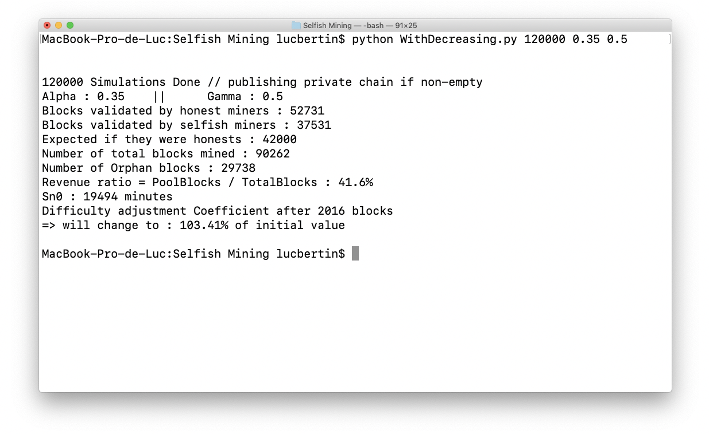
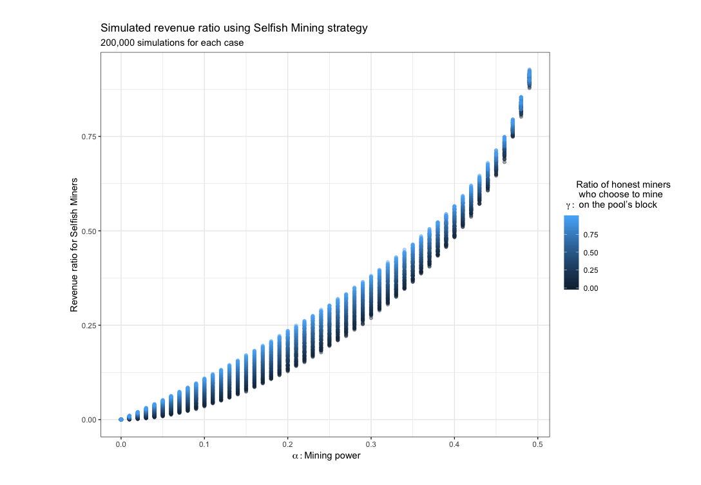

# Everything about bitcoin selfish-mining profitability using Python 
### An ultimate end-to-end simulator coded in Python to verify theorical results based on 'Majority is not enough' AND 'on profitability of selfish-mining' , discussing on ways to improve bitcoin protocol
#### Based on the paper: *Majority is not Enough* [link] (https://www.cs.cornell.edu/~ie53/publications/btcProcFC.pdf)
#### and [*On profitability of Selfish Mining*](https://webusers.imj-prg.fr/~ricardo.perez-marco/publications/articles/OnSelfishMining20.pdf)


Today we're going to discuss on a well-known strategy in bitcoin mining named selfish -or stubborn- mining. No prerequisities needed, by the end of this reading you'll have a deep understanding of how this weakness could been  used for profitability purposes and become a threat to the bitcoin system itself.

## Overall,  what's blockchain ?

The *blockchain* is the protocol on which *bitcoin* is based. These 2 terms have received a lot of public attention over the past few months, despite they have been both created purposefully a few years ago.

Bitcoin blockchain is, to put it plainly, a huge log in which each bitcoin transactions in the world are encrypted. It is subdivided in block, and each block can contain multiple transactions.

Here is a overview of the above definition taken from [Blockchain France](https://blockchainfrance.net/decouvrir-la-blockchain/c-est-quoi-la-blockchain/)


Thus, to ensure transactions, blocks need to be  mined (broadcoast to the network, and validated by general consensus). That's achieved resolving a cryptopuzzle with increasing complexity, requiring computer ressources as Proof of Work. In return, miners are granted all transactions fees within the block they broadcast to the network in addition to new bitcoins (until max supply is reached), as an incentive.

One could mine on its own, but with increasing complexity, and the probability of mining a block being proportional to computational resources invested in, miners tend to organize themselves into mining pools (1). This doesn't change one miner's expected revenue, but decreases the variance of their income rate (2) as they increase in average the probability of mining a block from their pool. After being mined, the block is published to be added on top of main blockchain.

"Problem difficulty is dynamically adjusted such that blocks are generated at an average rate of one every ten minutes" (3). If 2 different miners/pools found both a block in this time interval, and publish it to the main blockchain, the chain is forked into 2 branches. Any addition on top of one branch, within the next 10 minutes interval, which could differentiate branch lengths, will validate one branch and discard the other, making blocks contained within the dropped branch orphans blocks, with computational ressources used for … nothing.


Thus, to ensure transactions, blocks need to be created or - in other terms - 'mined'. That's achieved resolving a cryptopuzzle with increasing complexity, requiring computer ressources. One could mine on its own, but with increasing complexity, and the probability of mining a block being proportional to the computational resources, miners tend to organize themselves into mining pools (1). This doesn't change one miner's expected revenue, but decreases the variance of their income rate (2) as they increase in average the probability of mining a block from their pool. After being mined, the block is **published** to be added on top of main blockchain.


## This is when Selfish-Mining comes in !

It appears there is a strategy named Selfish Mining which consists, with a possible lead from selfish miners (SM), in keeping mined blocks unpublished to the network, and releasing it one at a time whenever others outside the pool find a block, to maintain the branches equal. This way, when others – we will name afterwards as honest miners – catch up with their delay and almost close the gap as the lead drops to 1, selfish miners release the rest of their private branch, leaving the entire honestly-mined'one orphan, unused, dropped, with wasted computational ressources...

Selfish mining, if profitable, is considered being a threat to Bitcoin and blockchain principle of decentralization as honest miners could join whatsoever one big, unique, growing selfish pool.
Our will is to demonstrate,  in practice, to what extent Selfish strategy could be profitable, based on simulations and coding.

Our will is to demonstrate to which extent Selfish strategy could be profitable.

## A first, limited, approach drawn in Eyal and Sirer' paper: 'Majority is not enough'
#### Related python file : Selfish_Mining.py
For the following, i wish to draw your attention on 2 parameters

* **alpha** : relative mining power of selfish pool / in other words 'what are the computational ressources of selfish miners with respect to entire mining network'. An α of 0.35 means selfish miners detain 35% of the entire network computing power.  1-α is then the relative mining power of honest miners. This simulation will then be a 2 cases approach.

Mostly, in Bitcoin blockchain we consider α to be well inferior to others'power (honests'one here) as selfish miners represent a small part of the entire blockchain miners. Though, as it might not be the case for other blockchains, it will be possible to play on this parameter to look at how does the system behave in extreme cases either.

* **gamma** : ratio of honest miners who choose to mine on selfish pool's chain (then unwittingly helping selfish miners). 1-γ is then the ratio of honest miners who choose to mine on their own branch.

By now you should completely understand the simple state machine with transition frequencies figuring in Majority is not enough and attached below, modelizing the different changes in Delta (selfish miners'lead on honest miners) at each step.


Delta is 0 (i.e. selfish lead is null) at initiation, or when equality between both branches. In case of equality, γ will mine on selfish chain, 1-γ won't. Delta > 2 : Selfish miners  are comfortably ahead of honest miners and keep on mining anonymously releasing one block at a time whenever honest miners find a block. Delta is < 0 : Selfish miners adopt public chain, as honest miners mined one block advance so that delta stays 0 at least. Delta is 1: honest miners could either catch up with their delay leading to equality, or selfish miners set the lead to 2. if Delta is 2: honest miners could either catch up with their delay, closing the gap as the lead drops to 1, or selfish miners strengthen their current lead. In the former case, selfish miners will publish their all chain to make sure they won't have wasted computational ressources.


#### Revenue :
*Revenue* : revenue belongs to the miner only if the block found by the miner ends up being published
in the main public chain. 
WARNING : if honest miners block on selfish miners chain in case of competitive case (1-1), after publication of private chain, each of them will be granted the same revenue for their own mined block

#### Implementation : 

Implementing that in a beautiful and concise Python class should just be a child's play by now with 2 methods triggered when honests miners find a block, or when selfish miners do.

What about simulation itself ? Well let's define nb_simulations as the number of block to be mined, and could simply loop on it. I won't show the code as i will later on, in part 2.
This is a simple demo of what could be the results with respect to parameters passed in console. With α=0.35 and γ=0.5, selfish miners (SM) validated 41.6% out of the total number of validated blocks. Nearly 24% of all mined blocks became orphans. SM strategy became profitable since they expected larger revenue than if they behave as HM (and would have validated 42K blocks).

This is a simple demo of what could be the results with respect to parameters passed in console. With α=0.35 and γ=0.5, selfish miners (SM) validated 41.6% out of the total number of validated blocks. Nearly 24% of all mined blocks became orphans. SM strategy became profitable since they expected larger revenue than if they behave as HM (and would have validated 42K blocks).



It is also possible to track progress for each simulation, as shown in [simulator step1 results](./img/example_steps_1.png) and [simulator step2 results](./img/example_steps_2.png)

Finally, I created a table for multiple **gamma** and **alpha** combinations with a sufficiently high number of simulations (200,000), here are the plotted results that show when is Selfish Mining a profitable strategy.



Eyal and Sirer' paper helped us to put the foundations of a fully operationnal selfish mining (SM) simulator. But we're not done yet ! we still have to show to what extent this method is limited, as it doesn't reflect some of the reasons why some would adopt selfish mining strategy over behaving as simple honest miners !


## A 2nd, much closer to real-life approach,  detailed in 'on profitability of Selfish Mining' : 
#### Related python file : WithDecreasing.py

One of the biggest weaknesses of the previous article is to undermine time variable in this problem. Remember: we said at the beginning of this article that "Problem difficulty is dynamically adjusted such that blocks are generated at an average rate of one every ten minutes". Indeed, after 2016 validated blocks, a comparison is made between the time it took for the network to validate 2016 blocks, and the time it should have taken in normal conditions of 1 validated blocks each 10 min.


After 2016 validated blocks, B the coefficient that will lower or increase difficulty. It is expressed as the ratio of the time it took to validate 2016 blocks (Sn), and the normal time it should have taken (2016 blocks / 10 min each => 20160 minutes in total so approximately 2 weeks). As an iterative process the difficulty adjustement coefficient B[i] after the ith-2016 validated blocks can be expressed as B[i-1] multiplied by the new time ratio Sni/20160


Thus, if computational ressources of the network increase (new miners, or technology is evolving), or the other way around (less people participating to mining) the expected time of 20160 minutes it should take will always be balanced by this coefficient B.

So what's the matter here ? Well, it appears that the more people adopt a selfish mining attitude, the more orphan blocks will be numerous, the bigger time to validate 2016 blocks will be and then, the more difficulty will decrease, making time to validate next 2016 blocks way faster.

Of course, this difficulty adjustment will help both selfish miners and honest miners and their respective revenue ratio won't change at last as on the results displayed in the console in part 1 (SM will still have around 41.6% at last of the total number of blocks for α=0.35 and γ=0.5). 

But think about it as an individual or a pool who chooses to become selfish rather than honest -and then probably invest more ressources at first stage- so that it would lower the difficulty. After difficulty adjustment, they would mine and validate way faster next blocks, even if others would validate blocks faster too.

Thus, at individual level, one would expect invest ressources lowering the difficulty and making profit after a certain waited time T
Let's finally go back to Python and make this so-much-anticipated BSECOM: Best Simulator Ever Created On the Market ;-)
Initalisation of variable of interest: At first B coefficient is set to 1 for iterativity:

Simulation. This is the most beautiful part. Let's break it down otherwise it will be tricky to understand the implementation.
* ```nb_simulations``` is the number of blocks to be mined for simulation.
* ```SepBlocksEach2016``` will break down nb_simulations by 2016 blocks (so that we actualize B each time we finish validating 2016 blocks) 

Mathematically speaking, finding a block can be modeled as 2 independent Poisson processes (one for SM, one for HM). Interval times between each new find then follow an exponential law with a rate  λ= α*10 (for 10min) for SM, and (1-α)*10 for HM.


* For each element in ```SepBlocksEach2016```, 2 lists ```TimesBlocksFoundSM```, ```TimesBlocksFoundHM``` will then  be lists of interval times (e.g. 12min, 8min, 9min, 15min) for both Selfish miners and Honest miners, independently. We cumsum both list to not have simply intervals but actual times when blocks have been mined since time=0 (e.g. following last example : 12min, 20min, 29min, 46min). Sizes of those lists are both fixed to 2016 or the number of if nb_simulations < 2016.

Now we got 2 distincts list, it's time to gather them into one list saving all times/blocks mined by each party since the beginning. Using an **orderedDict** (otherwise we wouldn't be able to order keys):

* ```TimesAllBlocks``` will save all times AND who found the corresponding block (SM/HM)

We will loop on TimesAllBlocks, and retrieve for all item, the block number, its corresponding time of finding defined ascurrentTimestamp. We can now call the methodsOn_Selfish_Miners andOn_Honest_Minersas in part1. The cool thing about having created a class is that those variables can be saved, used and re used on other instance methods, and it really elegantly break the process down.

The rest of the code inside this loop is quite self-explanatory:

* if the ```counter``` (e.g. block number) reached the number of simulation the loop is terminated. 
* if ```TotalValidatedBlocks``` reached a multiple of 2016 or more (as SM could broadcoast numerous blocks in a row and surpass 2016, same for 4032, 6048, 8064,…), coefficient of difficulty adjustment B is actualized based on the currentTimestamp. Other blocks won't be taken into account in the ```orderedDictv``` and we'll pass to the other sequential index in SepBlocksEach2016 without forgeting to add the last currentTimestamp as basis to the next ```TimesBlocksFoundSM```, ```TimesBlocksFoundHM``` created lists. 
* Note that I also decided to write in a file each 200 validated blocks for further research; and to broadcast the private selfish miners chain, if not empty after simulation ends. Up to you to modify it at your convenience.


## Then, what are the true conditions of profitability ? How much time should i wait for selfish mining to become profitable ?

This is an example of difficulty readjustment over 2016/4032/etc… validated blocks, expressed in pourcentage. 


Logically, when α=0, as all blocks are validated by honest miners at a rate of 1-per-10 minutes, then no adjustement are needed and difficulty stays at 20160/20160 =1 = 100% of initial difficulty value. As α increases, so time for 2016 validation does, this pourcentage is lowered. But after 1st readjustment, we got back to the actual 1-per-10 minutes rate, even with generated orphan blocks, for the next iterations.


The below plot show other interesting results. For different set of 'α|γ', red line represent Selfish miners' validated blocks per time while blue dashed one is for selfish if they behaved as honest miners since the beginning. Upon 2016 validated blocks, a change in red line slope occurs. Once again that's logical as the revenue per time is increased after difficulty adjustement. Had they behaved honestly, there wouldn't have been difficulty adjustment, so the rate would have stayed constant (as showed by the blue line). Some outliers might be due to number of saving-step.


Last plot, which answers our initial question : 'How much time should i wait as a selfish miner to become profitable' ? Well, simulations confirmed here theoretical results on the paper (here in red):


## Conclusion
 
What we can suggest to improve bitcoin protocol is a modification in difficulty adjustment equation, which should take into account the number of orphan blocks generated. Another plot will follow to confirm that :


would prevent Bitcoin from Selfish Mining attacks.

Also, even though this simulator gave a good insight of what could a real-time selfish mining strategy look like in terms of profits, it doesn't take into a more-than-2-cases party (SM vs HM). We could imagine a fragmented environment with n pools of selfish miners such as SM1,SM2,… SMN, and honest miners, and  i personally don't think that should be an hassle to implement it from this code.
To finish, i hope you thoroughly enjoyed this reading. This was my first post on here. You can find all code in my attached Github.

If you ever want to support this work i created a QR-code BTC adress: 3N5F5by91ZkEbk1UoMRPNtxdrHSJWXJ7rf


